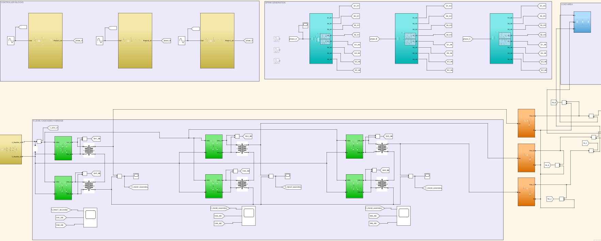
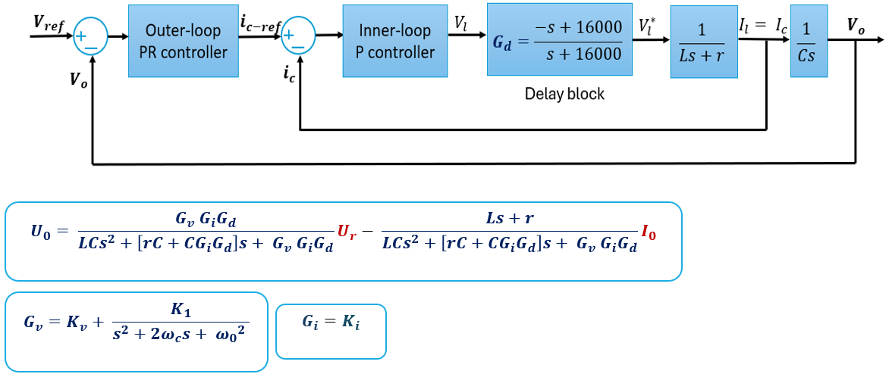
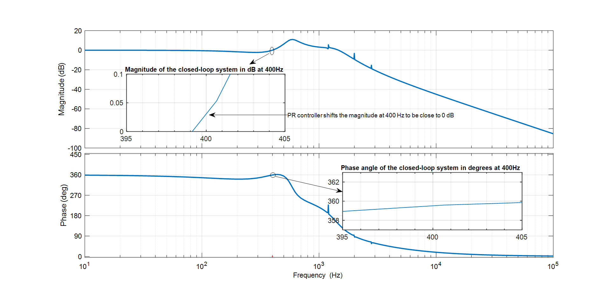
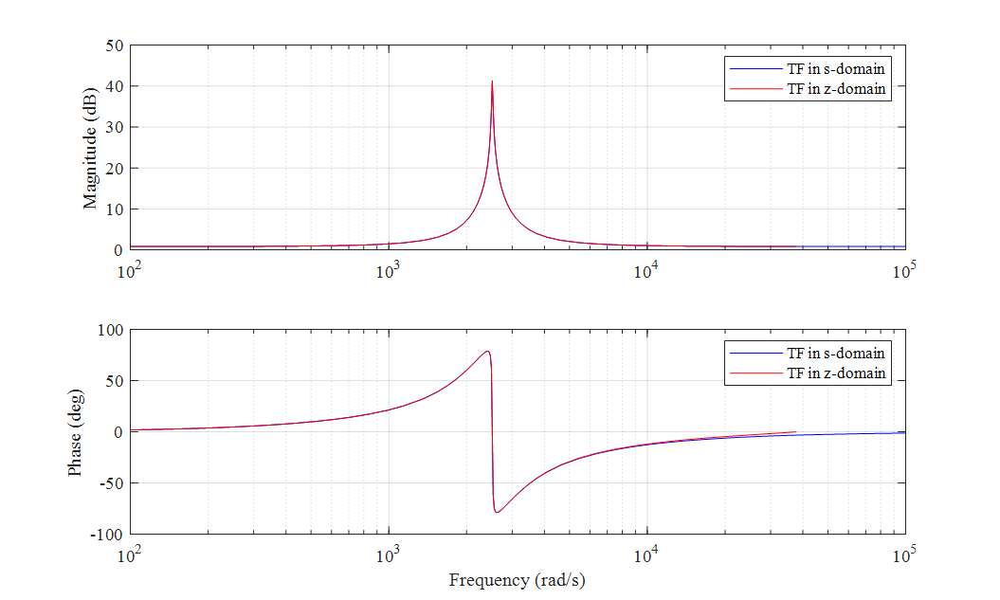
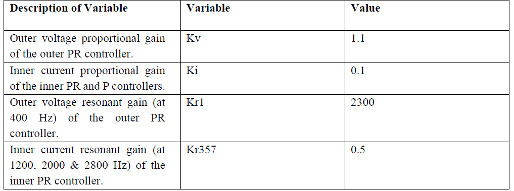
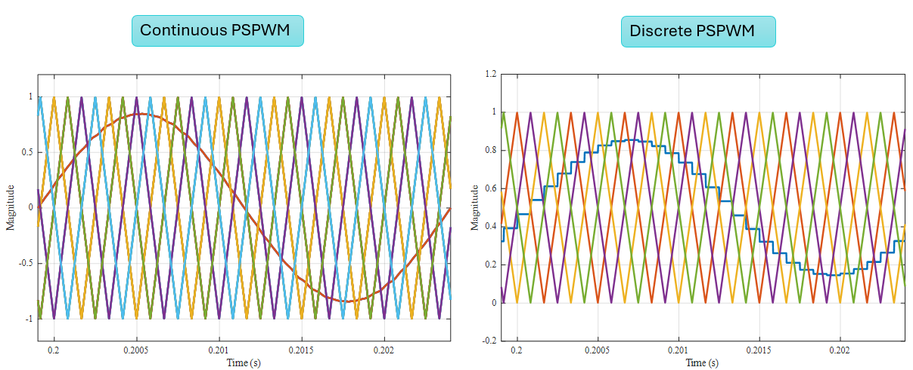
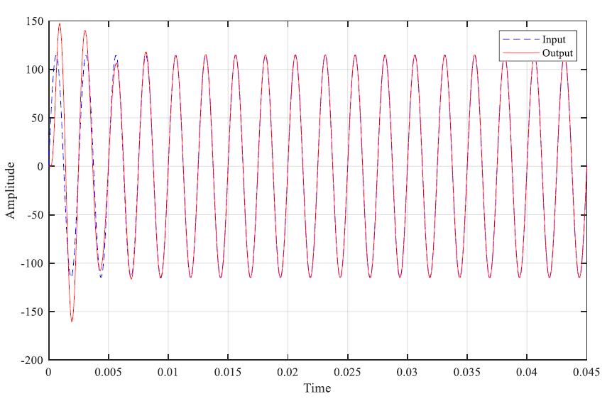

# Design and Simulation of a 400 Hz Output Power Converter

## Overview
This project focuses on the design and simulation of a 400 Hz output power converter for aerospace and naval applications, where reduced size, weight, and high power quality are critical.

## Objective
To design a high-performance converter capable of maintaining precise voltage regulation and low harmonic distortion under varying load conditions.

---

## System Design

### Converter Topology
- 5-level cascaded H-bridge converter  
- Modular structure using two H-bridges  
- Reduced voltage stress on switching devices  
- Improved output waveform quality  

### Switching Strategy
- Unipolar phase-shifted PWM  
- Achieves high effective switching frequency  
- Reduces switching losses in high-power operation

---

### Overall System Model

Complete system model of the 400 Hz 5-level cascaded H-bridge converter with cascaded PR (voltage) and P (current) controllers.

---

## Control Strategy

### Cascaded Control Structure
- Outer voltage loop: PR controller tuned at 400 Hz  
- Inner current loop: simplified P controller  

This structure provides accurate voltage tracking while reducing control complexity.

---

### Control System with Delay

Closed-loop control system including delay to account for real-world microcontroller processing effects.

---

### Controller Simplification

Comparison of PR+PR and PR+P cascaded control structures showing similar frequency response, enabling reduced complexity.

---

## Controller Design and Analysis

### Closed-Loop Frequency Response

Bode plot showing 0 dB magnitude and 0° phase at 400 Hz, indicating perfect sinusoidal tracking.

---

### Resonant Controller Validation

Comparison of S-domain and Z-domain PR controller responses showing matching magnitude and phase with resonance at 400 Hz.

---

### Controller Gain Selection

Optimized controller gains obtained using Bode plot and root locus analysis to ensure stability and performance.
MATLAB SISO Tool used for gain tuning. 

Design objectives:
- Adequate gain margin  
- Sufficient phase margin  
- Stable pole placement in the left half-plane

---

## Digital Implementation

- Controllers designed in S-domain  
- Converted to Z-domain using Tustin method  
- Prewarping applied to preserve resonance characteristics  
- MATLAB `c2d` used for discretization  

---

### Continuous vs Discrete Implementation

Comparison between continuous (analog signals) and discrete implementation using digital signals generated by microcontroller logic.

---

## Performance Evaluation

### Time-Domain Response

Closed-loop system response showing accurate tracking of the sinusoidal reference signal.

---

## Filter Design

- LC filter used to reduce harmonic distortion  
- Inductor smooths current  
- Capacitor smooths voltage  

Low-order harmonics suppressed by control, higher-order harmonics filtered by LC network.

---

## Tools Used
- MATLAB  
- Simulink  

---

## Files
- Thesis_Report.pdf  
- MATLAB scripts  
- Simulink models (continuous and discrete)  

---

## Conclusion
This project presents the complete design of a 400 Hz power converter integrating multilevel topology, advanced control strategies, and digital implementation. The system achieves high power quality, stable operation, and efficient harmonic suppression, making it suitable for demanding applications.

---

## Author
Royalty Holyworth Chihava
